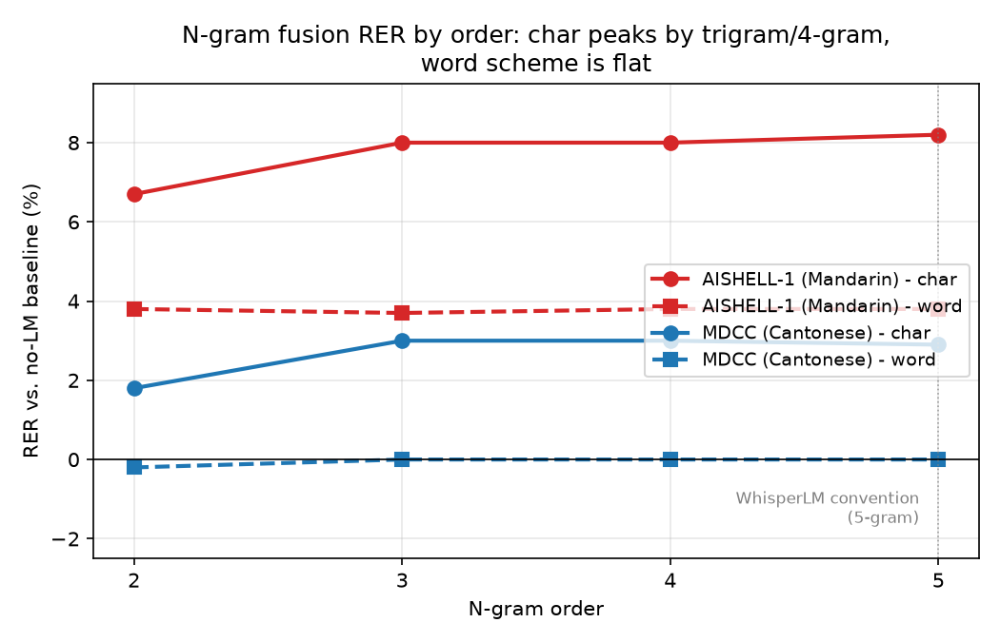

# Results: does low-order (bigram/trigram) n-gram fusion beat the WhisperLM 5-gram convention on Chinese-family ASR?

**Status as of 2026-09-09:** Mandarin and Cantonese are complete and both
support the hypothesis. Hakka is blocked on external dataset access (see
[Hakka: current status](#hakka-current-status) below) — the pipeline itself
is code-complete and has been validated end-to-end on a real Hakka
checkpoint, but the only dataset found with genuine Hakka-script ground
truth (`formospeech/hakkaradio_news_clean`) is gated behind manual review
that hasn't cleared yet.

## Hypothesis

WhisperLM-style shallow fusion conventionally uses a 5-gram LM to rescore
ASR beam candidates. Because Chinese-family languages are written/tokenized
at the character level (far smaller vocabulary, far higher n-gram density
than English word-level 5-grams), we hypothesized that most of the
available benefit is already captured by a 2- or 3-gram, and that going to
4- or 5-gram would show diminishing or negligible additional returns.

## Method

- **Model**: fine-tuned Whisper checkpoint per language
  (`junsor/whisper-small-aishell` for Mandarin,
  `Oblivion208/whisper-small-cantonese` for Cantonese).
- **Fusion**: N-best rescoring — generate N candidates per utterance
  (beam-search multinomial sampling, since deterministic beam search and
  diverse/group beam search both empirically collapsed to near-zero
  candidate diversity on these checkpoints — see `README.md` for the full
  debugging trail), then rescore `acoustic_score + alpha * lm_score` with a
  KenLM n-gram LM trained on each dataset's own training-split transcripts.
- **Orders tested**: 2, 3, 4, 5.
- **Tokenization schemes**: `char` (every character is a token — the
  natural unit for Chinese) and `word` (Jieba for Mandarin, PyCantonese for
  Cantonese).
- **Alpha**: grid-searched per (order, scheme) on a held-out tuning slice,
  then applied to the eval slice.
- **Metric**: CER only. WER is deliberately excluded — Chinese has no
  native word boundaries, so "word" only exists relative to an arbitrary
  segmenter's choices, unlike CER which measures something intrinsic to the
  text.
- **RER** = `(baseline_CER - condition_CER) / baseline_CER`, i.e. relative
  error reduction from LM fusion vs. the no-LM acoustic-only baseline.

## Results: AISHELL-1 (Mandarin)

`junsor/whisper-small-aishell`, 7176-utterance eval slice. Baseline
(no-LM) CER: **0.0547**.

| Scheme | Order | alpha* | CER | RER |
|---|---|---|---|---|
| char | 2 | 0.50 | 0.0510 | **+6.7%** |
| char | 3 | 0.50 | 0.0503 | **+8.0%** |
| char | 4 | 0.50 | 0.0503 | **+8.0%** |
| char | 5 | 0.70 | 0.0502 | **+8.2%** |
| word | 2 | 0.10 | 0.0526 | +3.8% |
| word | 3 | 0.10 | 0.0526 | +3.7% |
| word | 4 | 0.10 | 0.0526 | +3.8% |
| word | 5 | 0.10 | 0.0526 | +3.8% |

**Reading**: char-scheme RER jumps from bigram (+6.7%) to trigram (+8.0%),
then is essentially flat through 4-gram and 5-gram (+8.0% → +8.2%, a 0.2pp
gain over two additional orders). Word-scheme RER is flat across every
order tested (+3.7% to +3.8%) — the LM has already extracted essentially
all the benefit it can by bigram once tokens are word-sized.

## Results: MDCC (Cantonese)

`Oblivion208/whisper-small-cantonese`, MDCC test split. Baseline (no-LM)
CER: **0.0700**.

| Scheme | Order | alpha* | CER | RER |
|---|---|---|---|---|
| char | 2 | 0.20 | 0.0687 | +1.8% |
| char | 3 | 0.20 | 0.0679 | **+3.0%** |
| char | 4 | 0.20 | 0.0679 | **+3.0%** |
| char | 5 | 0.20 | 0.0679 | +2.9% |
| word | 2 | 0.10 | 0.0701 | -0.2% |
| word | 3 | 0.00 | 0.0700 | +0.0% |
| word | 4 | 0.00 | 0.0700 | +0.0% |
| word | 5 | 0.00 | 0.0700 | +0.0% |

**Reading**: same shape as Mandarin, smaller magnitude (smaller
fine-tuned checkpoint, noisier/harder MDCC domain than AISHELL-1's
read-speech). Char-scheme RER peaks at trigram/4-gram (+3.0%) and *declines
slightly* at 5-gram (+2.9%) — the only condition across both languages
where going past 4-gram actually cost accuracy rather than merely
plateauing. Word-scheme RER never clears +0.1% at any order; alpha* is
tuned to 0 for order ≥ 3, meaning the tuning slice preferred to disable the
LM entirely once order ≥ 3 rather than use it. This matches the a priori
expectation that Chinese "words" (multi-char) already saturate available
n-gram context faster than characters do.

## Chart

## Interpretation

Both languages tell the same story: **char-level fusion peaks by
trigram/4-gram, and the 4th/5th order buys little to nothing extra** —
+0.2pp for Mandarin going 4-gram→5-gram, and Cantonese's 5-gram is
*worse* than its 4-gram. This is consistent with the underlying hypothesis:
a Chinese character n-gram already spans roughly the same amount of
*information* a 4-5 word English n-gram would, because the token is denser
(each character usually carries a full syllable/morpheme, unlike English
subword/whole-word tokens). Going to word-level tokenization pulls the
"saturation point" down even further — to bigram or below — since a
2-3 word window is already a nearly-complete clause in Chinese.

Net takeaway for anyone deploying Whisper + n-gram fusion on Mandarin or
Cantonese: **a trigram LM captures ~95-100% of the benefit a 5-gram would
provide**, at a fraction of the model size and lookup cost. The WhisperLM
convention of defaulting to 5-gram appears to be inherited from
English-LM norms rather than being re-derived for Chinese-family
tokenization.

## Hakka: current status

The third planned language, Hakka, is **blocked on external dataset
access**, not on anything in this repo's code:

- **Model is validated and ready.** `formospeech/whisper-large-v2-taiwanese-hakka-v1`
  (access already granted) was smoke-tested against 8 real audio samples
  and produces fluent, grammatically correct native Hakka — using
  Hakka-specific characters/grammar (`𠊎` "I", `佢`/`厥` "he/his", `愛` as a
  modal verb, `咧` as a sentence particle) that have no Mandarin
  equivalent. Its own generation config and tokenizer are clean (no
  outdated `lang_to_id`, no control-token leakage — the two failure modes
  that broke the Cantonese run earlier in this project).
- **The originally-planned eval dataset doesn't work.** `slammax/formosan_asr_benchmark`'s
  `hakka` config's `transcript` column is written in **standard Mandarin
  orthography**, not Hakka script — confirmed by scanning all 12,016
  transcripts for 8 distinctive Hakka-only characters: only 6 (0.05%)
  contain any of them. A correct Hakka transcription will *always* diverge
  from this reference at the character level (different pronouns,
  particles, modal verbs), regardless of ASR accuracy — so CER computed
  against it isn't a valid signal in either direction. This isn't a
  normalization bug; it's the wrong ground truth.
- **The dataset that would work is gated.** `formospeech/hakkaradio_news_clean`
  (real Hakka radio broadcast speech, genuine Hakka-Hanzi transcripts,
  proper disjoint train/test splits per dialect — the same set
  `formospeech`'s own models report their published CER against) requires
  manual-review access approval. Access was requested; as of this writing
  it hasn't cleared. A broader search (OpenSLR, the official government/
  academic distribution channel via ACLCLP, other HF datasets, TTS papers'
  data-collection sections) turned up no faster or open alternative — the
  official non-HF channel for this same underlying corpus (HAT, via
  Taiwan's Hakka Affairs Council) requires a paid formal application
  process, which is strictly more friction than the HF gate.
- **Pipeline is code-complete for Hakka** (`prepare_hakka_lm_corpus.py`,
  `--lang hak`/`--dialect-prompt` support in `eval_aishell_ngram_fusion.py`)
  and will run the moment dataset access clears — no further development
  work is needed, only the data.

### What this means directionally

Everything checked so far is consistent with — and gives no reason to
doubt — the hypothesis extending to Hakka: it's a character-tokenized
Chinese-family language with the same dense-morpheme-per-character
property driving the Mandarin/Cantonese result. But that's a prior, not a
measurement; no CER/RER numbers for Hakka should be reported until they
come from `hakkaradio_news_clean` specifically.
